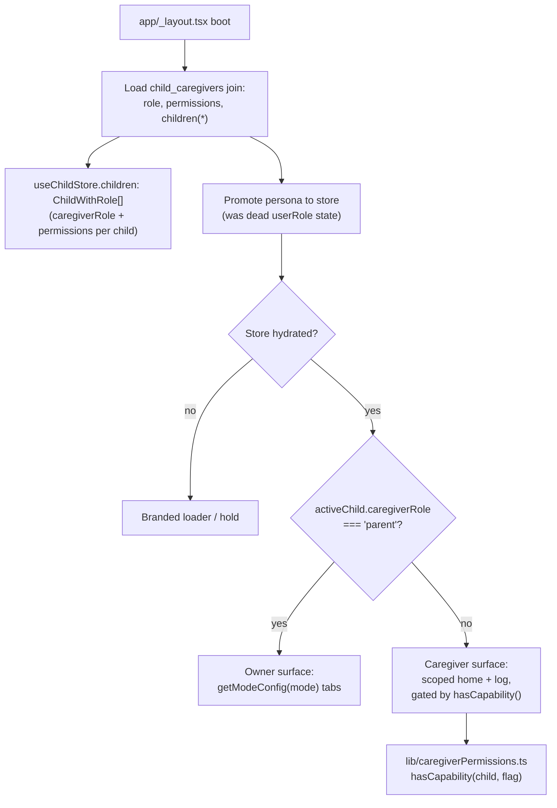
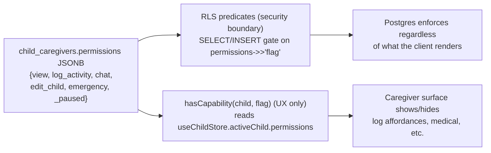

# feat: Caregiver-Scoped Surface & Capability Enforcement (Phase 1)

Phase 1 of the caregiver-roles / lifelong-child-record initiative. Delivers the daily
nanny→record loop: a nanny opens the app, sees a purpose-built surface scoped to the
child(ren) and capabilities the owner granted, and logs the child's day into the permanent
record — replacing the WhatsApp relay. The owner sees those logs live and controls each
caregiver's access via preset roles.

---

## Summary

A nanny today relays a child's day over WhatsApp and nothing persists. This plan makes the
nanny a first-class, scoped contributor to the child's permanent record.

The work splits into two halves that research reframed sharply:

- **The data layer is *mostly* enforced — with two verified holes.** Contrary to the
  brainstorm's premise, RLS already gates caregiver **writes** on `_paused`, `log_activity`,
  `edit_child`, and `chat` (the 06-15→06-17 hardening migrations), with owner-forging triggers and
  invite-token expiry. But two **read** gaps remain (verified against migrations): `chat_messages`
  SELECT gates only on `accepted` + `_paused` — **never on the `chat` flag**, so a caregiver with
  `chat:false` can read the full AI chat history; and the `view` key has **no RLS consumer at all**.
  Phase 1 **extends** the enforced model and **closes these two read holes** (U7) — it does not
  rebuild what already works.
- **The UI layer is greenfield.** A caregiver still sees the full parent dashboard.
  `profiles.user_role` is loaded at boot but never read. No client permission-check helper
  exists. This is where most of Phase 1's net-new work lives.

Phase 1 therefore: (1) builds a **caregiver-scoped home/log surface** gated by a new client
permission helper; (2) **expands the enforced capability model** within the existing
`permissions` JSONB and closes the verified enforcement gaps (sensitive PHI columns are
all-or-nothing → U3; `chat_messages` SELECT and the `view` key are unenforced reads → U7); and
(3) routes caregiver-persona users to the scoped surface instead of the owner dashboard.

Per-activity capability toggles (a 13-switch matrix), shared agenda, reminder suggestions,
caregiver community, and recap/export are explicitly out of Phase 1.

---

## Problem Frame

**Who:** the Owner (parent who owns the child record) and the Nanny (professional caregiver,
the daily data source). (see origin: docs/brainstorms/2026-06-26-caregiver-roles-child-record-requirements.md — Primary Actors)

**The pain:** documentation of a child's early life scatters across chat history. The
caregiver is the daily source of that documentation but has nowhere durable to put it, and
the owner has no real control over what a caregiver can see.

**Why now / why this shape:** the schema, invite/accept flow, and server-side enforcement
already exist. The missing pieces are a caregiver-facing surface and the client-side gating
that makes the granted permissions visible and usable. Building the surface is the smallest
addition that turns existing infrastructure into the core product loop.

**Re-baselined premise (load-bearing):** the brainstorm states permissions are "stored but
not enforced." Research against the live `supabase/migrations/` proved this **materially out
of date** — see Key Technical Decision KTD-1. This plan is scoped to what is genuinely
missing, not to re-solving enforcement.

---

## Requirements Traceability

Carried from the origin requirements doc (Phase 1 section + Success Criteria):

- **R1** — A nanny can be invited with a role; the owner can add/remove capabilities; the
  nanny's in-app experience reflects exactly those capabilities (nothing more).
- **R2** — A nanny logs a child's day (meal, photo, memory, milestone, sleep, diaper, mood)
  and the parent sees it live in the child's record.
- **R3** — A withheld capability (e.g. medical) is genuinely inaccessible — enforced at the
  data layer (RLS), not just hidden in UI.
- **R4** — A caregiver sees a purpose-built surface, never the full parent dashboard.
- **R5** — The record persists and is structured to be exportable later (no schema choices
  that block Phase 5 export).

Scope decisions made during planning (see origin Outstanding Questions Q1, Q2):
- **D1** — The capability model extends the existing `permissions` JSONB; no
  `caregiver_capabilities` table in Phase 1. (origin Q1)
- **D2** — Phase 1 keeps the three preset roles (View Only / Contributor / Full) rather than
  a per-activity toggle matrix. (origin Q2; fine-grained toggles → Deferred)

---

## Key Technical Decisions

### KTD-1 — Treat existing RLS as the foundation; extend and patch, don't rebuild
Research confirmed `child_logs`, `chat_messages` (INSERT), `children`, and `kids_vaccine_schedule`
already enforce caregiver **writes** via `child_caregivers` subqueries that check
`status = 'accepted' AND is_locked = false AND (permissions->>'<flag>')::boolean = true AND
COALESCE((permissions->>'_paused')::boolean, false) = false`. Phase 1 mirrors this exact
predicate pattern for any new policy and never introduces a UI-only flag as an enforcement
boundary (the P0-1 "paused caregiver kept access" lesson from
`docs/reviews/2026-06-10-pre-friends-test-review.md`).

**Two verified read holes the foundation does NOT cover (U7 closes them):**
- `chat_messages` **SELECT** ("own or caregiver messages", `20260330010000_child_caregivers.sql:71`,
  re-created in `20260615120000_p0_security_fixes.sql`) gates only on `accepted` + `_paused`. The
  `(permissions->>'chat')::boolean = true` check exists **only in the INSERT policy**. So a
  caregiver with `chat:false` reads the full AI chat history — breaking R3.
- The `view` key is read by **no RLS policy** (`grep permissions->>'view'` across migrations = 0
  matches). "View Only" withholding is currently cosmetic at the data layer.

**RLS stays the security boundary; the client helper is UX only.**

### KTD-2 — Extend the `permissions` JSONB, not a new table
Per D1. The keys `view`, `log_activity`, `chat`, `edit_child`, `emergency` are already the
contract across the existing RLS policies and `app/profile/care-circle.tsx`. Phase 1 wires the
unenforced reads rather than adding new keys, keeping the preset model intact: `emergency` →
PHI gating (U3); `chat` SELECT (U7). The `view` key is resolved in U7 — either wired to
`child_logs`/`children` SELECT, or formally declared presentation-only (recommended, since every
current preset sets `view:true`, making a gate a no-op). A `caregiver_capabilities` table is
recorded under Deferred as the Phase 1.5+ option if per-activity granularity is later needed.

### KTD-3 — Widen `CaregiverPermissions` before writing any gating
`types/index.ts:69` declares only `{ view, log_activity, chat }`, but the DB and
`care-circle.tsx` already use `edit_child`, `emergency`, and meta keys (`_paused`,
`_display_name`, `_photo_url`). The type must be widened first or every consumer of the new
helper is silently untyped. (U1 blocks all helper/UI work.)

### KTD-4 — Caregiver surface selection lives one level above mode config
The persona decision data already exists at boot: `useChildStore.activeChild.caregiverRole`
is the per-child truth, and `profiles.user_role` is the coarse account persona (currently
dead state at `app/_layout.tsx:90`). Phase 1 promotes the persona into a store and branches
in `app/(tabs)/_layout.tsx` to select a caregiver surface **before** `getModeConfig(mode)` —
mode config stays untouched for owners. A caregiver who is also a parent of their own child
defaults to the owner surface for their own children and the caregiver surface for children
where `caregiverRole !== 'parent'`.

### KTD-5 — Split sensitive PHI into a gated path for R3
The `children` SELECT policy currently returns the full row (including `blood_type`,
`conditions`, `medications`, `allergies`) to any accepted caregiver — all-or-nothing. To make
"medical genuinely withheld" true (R3), sensitive columns move behind an `emergency`/`edit_child`
capability check. Decision deferred to U3's approach: prefer a column-gated view or a
`child_health` split table — resolved in U3, not here, because it depends on confirming which
columns are read by the caregiver surface vs. owner-only screens.

### KTD-6 — Hydration-gate the persona store
Any new persisted persona/role store must follow the documented convention: `hydrated: false`
+ `onRehydrateStorage: () => () => useStore.setState({ hydrated: true })` (the `setState`
form — the `state?.setHydrated()` form silently no-ops on fresh install, the `useBadgeStore`
bug). The caregiver surface must not render data-derived UI before hydration, or it flashes
the wrong persona (the `useModeStore` "week 1 → week 40 flash" class).

---

## High-Level Technical Design

### Persona resolution & surface selection (boot → render)

### Capability enforcement: two layers, one source of truth

The client helper and RLS read the **same JSONB keys**. The helper decides what to *render*;
RLS decides what is *permitted*. A capability is only "real" when both reference the same key.

---

## Implementation Units

### U1. Widen the caregiver permission type and add the capability helper

**Goal:** Establish a single, strict-typed source for evaluating caregiver capabilities on
the client. Foundation for all UI gating.

**Requirements:** R1, R4 · **Dependencies:** none

**Files:**
- `types/index.ts` — widen `CaregiverPermissions` (modify)
- `lib/caregiverPermissions.ts` — new helper module (create)
- `lib/__tests__/caregiverPermissions.test.ts` — unit tests (create)

**Approach:**
- Widen `CaregiverPermissions` (`types/index.ts:69`) to include `edit_child?`, `emergency?`,
  and optional meta keys (`_paused?`, `_display_name?`, `_photo_url?`) alongside the existing
  three. Keep keys optional + boolean so existing 3-key rows stay valid. (KTD-3)
- `lib/caregiverPermissions.ts` exports:
  - `hasCapability(child: ChildWithRole | null, flag: keyof CaregiverPermissions): boolean` —
    returns `false` for null child, owner short-circuits to `true` when
    `caregiverRole === 'parent'`, otherwise reads the flag, treating `_paused === true` as
    "no capabilities" (mirrors the RLS `_paused` predicate so UI and DB agree).
  - `isCaregiver(child): boolean` — `caregiverRole !== 'parent'`.
  - A `CAPABILITY` const enumerating the wired keys so call sites don't pass raw strings.
- Pure functions, no store/React imports, so they're trivially testable and reusable in RLS-mirroring tests.

**Patterns to follow:** mirror the RLS predicate semantics in
`supabase/migrations/20260616120000_p1_rls_fixes.sql` (the `_paused` + flag check) so the
client never shows an affordance RLS would reject.

**Test scenarios:**
- Owner (`caregiverRole === 'parent'`) → `hasCapability` returns `true` for every flag,
  including ones absent from the JSONB.
- Caregiver with `{view:true, log_activity:true}` → `true` for `view`/`log_activity`, `false`
  for `emergency`/`edit_child`.
- Caregiver with `_paused: true` → `false` for all flags even when individually granted
  (covers R3 / mirrors RLS).
- Null child → `false` (no crash).
- `isCaregiver`: parent → false, nanny → true, family → true.

**Verification:** unit tests pass; `npm run typecheck` clean; no existing consumer of
`CaregiverPermissions` breaks (the three original keys remain).

### U2. Promote caregiver persona into a hydration-gated store

**Goal:** Make the persona decision (owner vs. caregiver, and per-child role) readable by the
router and surface, replacing the dead `userRole` local state.

**Requirements:** R4 · **Dependencies:** U1

**Files:**
- `store/useCaregiverStore.ts` — new persisted store (create)
- `app/_layout.tsx` — write persona to store at boot instead of dead `setUserRole` (modify)
- `lib/signOut.ts` — add `useCaregiverStore` to the persisted-stores clear list (modify)
- `store/__tests__/useCaregiverStore.test.ts` — hydration + selector tests (create)

**Approach:**
- New `useCaregiverStore` holding `accountRole: string` (from `profiles.user_role`) and a
  `hydrated` flag, persisted via AsyncStorage. Follow the canonical hydration pattern from
  `store/useBehaviorStore.ts`: `hydrated: false` default + `onRehydrateStorage: () => () =>
  useCaregiverStore.setState({ hydrated: true })`. (KTD-6)
- In `app/_layout.tsx`, replace the dead `setUserRole(profile.user_role)` at line 277 with a
  store write; remove the unused `useState` at line 90 and the reset at line 421 (route the
  reset through the store's clear instead).
- Per-child role stays in `useChildStore.activeChild.caregiverRole` (already loaded) — the new
  store only carries the coarse account persona, not per-child data.
- Because `useCaregiverStore` is persisted, add it to the persisted-stores list in `lib/signOut.ts`
  so a shared-device sign-out doesn't leave a stale `accountRole` in AsyncStorage that survives into
  the next user's boot. (One-line addition; not the deferred multi-family work.)

**Patterns to follow:** `store/useBehaviorStore.ts` hydration flag + `onRehydrateStorage`
(canonical). Do NOT use `state?.setHydrated()` (the `useBadgeStore` no-op bug noted in research).

**Test scenarios:**
- Fresh install (no persisted value) → `hydrated` flips to `true` after rehydrate; default
  `accountRole` is `'parent'`.
- Persisted `accountRole: 'nanny'` → restored after rehydrate.
- Clear (sign-out path) resets `accountRole` to `'parent'`.
- `hydrated` is `false` on the synchronous first read before rehydration completes.

**Verification:** store tests pass; boot no longer references the removed `userRole` state
(`grep` clean); typecheck clean.

### U3. Close the PHI enforcement gap (R3) with a gated medical path

**Goal:** Make withheld medical data genuinely inaccessible at the data layer for caregivers
who lack `emergency`/`edit_child`, satisfying R3.

**Requirements:** R3 · **Dependencies:** none (DB-only; can land in parallel with U1/U2)

**Files:**
- `supabase/migrations/20260626120000_caregiver_phi_gating.sql` — new migration (create)

**Approach:**
- Confirm which sensitive `children` columns the caregiver surface needs to read vs. which are
  owner-only (`blood_type`, `conditions`, `medications`, `allergies`, `pediatrician`).
- Resolve KTD-5 here: implement either (a) a security-barrier view that exposes non-sensitive
  columns to caregivers while a separate policy/column-set gates PHI on
  `(permissions->>'emergency')::boolean OR (permissions->>'edit_child')::boolean`, or
  (b) a `child_health` split table with its own RLS gated on those flags. Choose based on how
  many call sites read the sensitive columns (fewer reads → view; many → split table).
- Wire the currently-unenforced `emergency` key into an actual RLS predicate so UI presets and
  DB enforcement stop drifting (the "view/emergency stored but no consumer" gap from research).
- The live `children` SELECT policy this unit must DROP/CREATE is **"own or caregiver children"
  in `supabase/migrations/20260615120000_p0_security_fixes.sql`** (not the p1 migration — that one
  touches `child_logs` and `children` DELETE, not `children` SELECT). Mirror its predicate shape
  (accepted + non-paused) and add the capability flag. End with `NOTIFY pgrst, 'reload schema';`.

**Patterns to follow:** the junction-subquery RLS pattern in
`supabase/migrations/20260616120000_p1_rls_fixes.sql` and `20260616130000_p2_rls_db_hardening.sql`;
migration conventions in `.claude/rules/supabase.md` (idempotent, `DROP POLICY IF EXISTS`
before `CREATE`, `NOTIFY pgrst`).

**Execution note:** Design the two-synthetic-user leak test alongside the policy, not after —
use the `rls-tester` agent's matrix (can caregiver-without-emergency read PHI? does revoke
take effect?). Dev/staging only, never production, never service-role.

**Test scenarios (RLS, two synthetic users):**
- Covers R3. Caregiver with `emergency:false` SELECTs the child → sensitive PHI columns are
  absent/null; non-sensitive columns still readable.
- Caregiver with `emergency:true` → sensitive PHI readable.
- Caregiver with `_paused:true` and `emergency:true` → PHI NOT readable (paused beats grant).
- Owner (parent) → full row readable, unchanged.
- After owner revokes `emergency`, the caregiver's next read no longer returns PHI.

**Verification:** `supabase db push` applies cleanly; `rls-tester` two-user matrix passes on
dev; owner-facing medical screens (`app/profile/health-history`, emergency card) still read
full data.

### U4. Caregiver-scoped home surface

**Goal:** A nanny opens the app and sees a purpose-built surface — assigned child(ren) and only
the affordances their capabilities allow — not the parent dashboard. (R4)

**Requirements:** R1, R4 · **Dependencies:** U1, U2

**Files:**
- `app/(tabs)/_layout.tsx` — branch on persona before `getModeConfig` (modify)
- `components/caregiver/CaregiverHome.tsx` — scoped home surface (create)
- `components/caregiver/CaregiverChildPicker.tsx` — multi-child selector for the caregiver (create)
- `lib/modeConfig.ts` — add a caregiver surface config or overlay (modify)

**Approach:**
- In `app/(tabs)/_layout.tsx`, before computing tabs from `getModeConfig(mode)`, check the
  active child's `caregiverRole`. When the active child is one the user is a *caregiver* for
  (not parent), render the caregiver tab set instead. (KTD-4) Owners are completely unaffected.
- `CaregiverHome` shows: the assigned child header (name/photo — non-PHI only unless
  `hasCapability(child,'emergency')`), a "log the day" entry point, and a recent-activity
  readout of what this caregiver has logged. Every section is wrapped in `hasCapability` so a
  View-Only caregiver sees a read-only surface and a Contributor sees log affordances.
- `CaregiverChildPicker` lets a nanny serving multiple children switch among them (multi-family
  context is data-present already via `useChildStore.children`; clean context-switch UI is the
  Phase 1 slice — full multi-account switching stays deferred).
- Gate render on `useCaregiverStore.hydrated` (KTD-6) with the existing `BrandedLoader`.

**Patterns to follow:** `getModeConfig` lookup shape in `lib/modeConfig.ts`; existing tab
structure in `app/(tabs)/_layout.tsx` (null `href` to hide a tab, per the vault pattern at
`:534`); `useTheme()` + `PaperCard`/`PillButton` per `DESIGN_SYSTEM.md`; reuse
`components/home/NannyUpdatesFeed.tsx` (presentational) for the activity readout.

**Test scenarios:**
- Owner viewing their own child → owner dashboard renders unchanged (no caregiver surface).
- Nanny (Contributor) → caregiver home renders with log affordances; no parent-only tabs.
- Nanny (View Only) → caregiver home renders read-only; log entry point hidden.
- Nanny serving two children → child picker switches active child; surface re-scopes.
- Render held behind `BrandedLoader` until `useCaregiverStore.hydrated` (no persona flash).
- `Test expectation: snapshot/interaction tests via the existing component test setup; persona
  branching logic extracted into a pure selector so it's unit-testable without a renderer.`

**Verification:** manual run as a seeded nanny account shows the scoped surface; owner account
unchanged; no persona flash on cold start.

### U5. Caregiver logging into the child record

**Goal:** A nanny logs meals, photos, memories, milestones, sleep, diaper, mood — and the
owner sees it live. The core loop. (R2)

**Requirements:** R2, R5 · **Dependencies:** U1, U4

**Files:**
- `components/caregiver/CaregiverLogSheet.tsx` — caregiver log entry (create)
- `components/calendar/KidsLogForms.tsx` — reuse `saveChildLog`; confirm `logged_by` + invalidation (modify if needed)
- `lib/queryClient.ts` — confirm `invalidateKidsLogQueries` predicate covers caregiver feed keys (modify if needed)

**Approach:**
- Reuse the existing `saveChildLog(childId, type, value?, notes?, photos?, date?)` from
  `components/calendar/KidsLogForms.tsx:258` — it already sets `user_id` from the child's
  `parent_id`, `logged_by` from the session user, and `date` via `toDateStr(new Date())`
  (local-date rule). RLS already gates the insert on `log_activity` (no new policy needed for
  meals/sleep/diaper/mood/photo).
- `CaregiverLogSheet` surfaces only the log types the caregiver's capabilities allow
  (`hasCapability(child,'log_activity')` for the activity types). Photo/memory uploads must
  target the **private** photo bucket (per `20260617130000_private_photo_buckets.sql`), never a
  public bucket (research §5 lesson).
- `saveChildLog` **already** calls `invalidateKidsLogQueries()` (verified at
  `components/calendar/KidsLogForms.tsx:287,307`) — no new invalidation call is needed. The real
  open question is whether the caregiver-feed and owner-feed query keys are prefixed
  `kids-`/`kids_`/`child-`/`child_` so the `lib/queryClient.ts` predicate matches them; verify and
  align the keys rather than adding invalidation.

**Patterns to follow:** `saveChildLog` / `invalidateKidsLogQueries` in
`components/calendar/KidsLogForms.tsx` + `lib/queryClient.ts`; `toDateStr(new Date())` for
`date` (never `toISOString().split('T')[0]`); private-bucket upload path with
`storage.foldername(name)[1] = auth.uid()`.

**Test scenarios:**
- Covers R2. Contributor nanny logs a meal → row lands in `child_logs` with
  `logged_by = nanny`, `user_id = child's parent`, `date` = local date.
- Owner's activity feed shows the nanny's log after invalidation (no manual refresh).
- View-Only nanny → log sheet does not offer write affordances (and RLS would reject anyway).
- Photo/memory log → file lands in the private bucket, not a public one.
- Logging at 11pm local west-of-UTC → `date` is local calendar day, not UTC next-day.
- `_paused` nanny attempts a log → RLS rejects; UI surfaces the denial gracefully rather than
  a silent failure.

**Verification:** seeded nanny logs across types; owner sees them live; `child_logs` rows have
correct owner/logger columns; photos in private bucket; `rls-tester` confirms a View-Only or
paused caregiver cannot write.

### U6. Owner capability management surface alignment

**Goal:** The owner can assign a preset role and the change is reflected in the caregiver's
surface — closing the R1 loop. Consolidate on the canonical care-circle UI.

**Requirements:** R1 · **Dependencies:** U1, U3

**Files:**
- `app/profile/care-circle.tsx` — confirm preset writes cover wired keys (modify if needed)
- `app/accept-invite.tsx` — show the actual granted permissions, not the hardcoded card (modify)
- `app/invite-caregiver.tsx` — send `permissions` (or route users to care-circle) (modify)

**Approach:**
- `app/profile/care-circle.tsx` is already the canonical surface writing the rich preset model
  (`PERMISSION_LEVELS` at `:154`). Confirm its presets include the now-wired `emergency` key
  end-to-end (Full level already lists it) and that pause/role updates round-trip.
- Fix `app/accept-invite.tsx:124-138` to display the **actual** granted permissions for the
  invite rather than a static view/log/chat card (research found it hardcoded), so the nanny
  sees what they'll get.
- `app/invite-caregiver.tsx` currently never sends `permissions`, so the edge function applies
  its default. Either send the chosen preset's permissions, or steer simple invites to
  care-circle. Pick the lower-friction option that doesn't fork the model (KTD-2).

**Patterns to follow:** `PERMISSION_LEVELS` mapping + `permObj` construction in
`app/profile/care-circle.tsx`; the `invite-caregiver` edge function's optional `permissions`
param (`supabase/functions/invite-caregiver/index.ts:58`).

**Test scenarios:**
- Covers R1. Owner sets a caregiver to View Only → caregiver's surface (U4) becomes read-only
  on next load.
- Owner upgrades to Contributor → log affordances appear.
- Owner grants Full → emergency/PHI becomes visible to that caregiver (ties to U3).
- Accept-invite screen shows the real granted capabilities for the token, not a static card.
- Invite created via `invite-caregiver.tsx` carries the intended permissions (not just the
  default).

**Verification:** owner changes a preset and the caregiver surface reflects it without a code
change; accept screen matches the actual grant; `rls-tester` confirms the DB agrees with the
displayed capabilities.

### U7. Close the chat-read and `view` enforcement holes (R3)

**Goal:** Make withheld `chat` and `view` capabilities genuinely inaccessible at the data layer,
not just hidden in UI — closing the two read holes KTD-1 identified so R3 holds for every
capability the owner can withhold, not only medical.

**Requirements:** R3 · **Dependencies:** none (DB-only; can land alongside U3)

**Files:**
- `supabase/migrations/20260626130000_caregiver_read_gates.sql` — new migration (create)

**Approach:**
- **`chat` read gate.** DROP/CREATE the `chat_messages` SELECT policy "own or caregiver messages"
  (currently `accepted` + `_paused` only — `20260330010000_child_caregivers.sql:71`, re-created in
  `20260615120000_p0_security_fixes.sql`) to add `AND (permissions->>'chat')::boolean = true` to the
  caregiver branch, mirroring the INSERT policy's predicate. The owner branch
  (`child_id IN (SELECT id FROM children WHERE parent_id = auth.uid())`) stays unconditional so
  parents always read their own child's chat.
- **`view` decision.** Resolve what `view` enforces, two acceptable outcomes — pick one explicitly
  in this migration:
  - (a) **Wire it:** require `(permissions->>'view')::boolean = true` on the caregiver branch of the
    `child_logs` (and `children`) SELECT policies, so a caregiver with `view:false` reads nothing.
    Use this if "View Only" should ever be revocable to "no access."
  - (b) **Declare it presentation-only:** if every preset that grants any access also sets
    `view:true` (the current `PERMISSION_LEVELS` reality — `view` is in all three levels), `view`
    is structurally always-true for any accepted caregiver and gating it changes nothing. In that
    case, document `view` as a UI-only label, drop it from the "wired keys" list in KTD-2, and
    leave SELECT gated on `accepted`/`_paused` as today. Recommended unless a "no-access-but-still-linked"
    state is a real product need.
- Mirror the established predicate shape; end with `NOTIFY pgrst, 'reload schema';`.

**Patterns to follow:** the `chat_messages` INSERT predicate in
`20260330010000_child_caregivers.sql` / `20260615120000_p0_security_fixes.sql`; the junction-subquery
RLS pattern in `20260616120000_p1_rls_fixes.sql`; migration conventions in `.claude/rules/supabase.md`.

**Execution note:** Design the two-synthetic-user leak test alongside the policy — caregiver with
`chat:false` must get zero `chat_messages` rows; owner still reads their own child's chat. Dev/staging
only.

**Test scenarios (RLS, two synthetic users):**
- Covers R3. Caregiver with `chat:false` SELECTs `chat_messages` for the child → returns zero rows.
- Caregiver with `chat:true` → reads the child's chat history.
- Caregiver with `_paused:true` + `chat:true` → zero rows (paused beats grant).
- Owner (parent) → reads their own child's full chat, unchanged.
- If `view` wired (option a): caregiver with `view:false` SELECTs `child_logs` → zero rows; with
  `view:true` → reads. If presentation-only (option b): `Test expectation: none — view is documented
  as UI-only; no RLS change to assert.`

**Verification:** `supabase db push` applies cleanly; `rls-tester` two-user matrix confirms a
`chat:false` caregiver reads no chat; owner chat reads unaffected; the `view` decision is recorded in
the migration comment and KTD-2 updated to match.

---

## Scope Boundaries

**In (Phase 1):** caregiver-scoped home + log surface; client capability helper; persona store
+ router branch; extend the enforced `permissions` JSONB and close the PHI + `view`/`emergency`
gaps; owner preset management alignment; caregiver multi-child context-switch (data-present).

### Deferred to Follow-Up Work (later phases / Phase 1.5)
- **Per-activity capability toggles** (the full ~13-switch matrix) and a possible
  `caregiver_capabilities` table — Phase 1.5 if preset roles prove too coarse. (origin Q1/Q2)
- **Shared agenda & coordination** — origin Phase 2.
- **Reminders & suggestions (approval flow)** — origin Phase 3.
- **Caregiver community / channels** — origin Phase 4.
- **End-of-tenure recap + lifelong export (PDF/video)** — origin Phase 5.
- **Multi-family multi-account context switching** (full account model) — beyond the
  data-present single-account switch shipped in U4. Depends on the sign-out/session-clear
  hygiene prerequisite (see Risks).

### Outside this product's identity (carried from origin)
- Turning the parent app into a generic team-permissions / arbitrary RBAC platform. Roles exist
  to serve the child record and the caregiver relationship.

---

## Risks & Dependencies

- **Stale brainstorm premise (mitigated).** The "not enforced" framing was re-baselined against
  live migrations (KTD-1). Risk: re-solving solved enforcement. Mitigation: U3 targets only the
  two confirmed gaps; all other writes rely on existing RLS.
- **Sign-out / session hygiene is a prerequisite for true multi-family** (Auth Audit P0-5):
  sign-out doesn't clear React Query cache or persisted stores, so a shared device leaks the
  previous user's data. Phase 1's single-account child-switch (U4) is safe, but full
  multi-family switching must not ship before a `lib/signOut.ts` clear-everything helper. Flagged
  as a Deferred dependency, not a Phase 1 unit.
- **PHI gating choice (U3)** ripples into owner-facing medical screens — verify owner reads are
  unaffected before merge.
- **Persona flash** (KTD-6) — the caregiver surface must gate on `hydrated`; an ungated render
  flashes the wrong surface. Tested in U2/U4.
- **RLS leak testing is definition-of-done**, not optional: every new/changed policy (U3, U5,
  U6, U7) gets the `rls-tester` two-synthetic-user matrix on dev/staging. U7's matrix must
  explicitly prove a `chat:false` caregiver reads zero `chat_messages` rows.
- **The plan trusted the existing RLS reframe too far (caught in review).** `chat` and `view`
  were assumed enforced but are not on the read path — U7 closes this. Treat any *other*
  "already enforced" assumption as verify-before-trust during implementation; the
  `rls-tester` matrix is the verification.

---

## Sources & Research

- Origin requirements: `docs/brainstorms/2026-06-26-caregiver-roles-child-record-requirements.md`
- Live enforcement baseline: `supabase/migrations/20260615120000_p0_security_fixes.sql`,
  `20260616120000_p1_rls_fixes.sql`, `20260616130000_p2_rls_db_hardening.sql`,
  `20260616140000_invite_token_expiry.sql`, `20260616150000_drop_insecure_caregiver_insert_policy.sql`,
  `20260617130000_private_photo_buckets.sql`
- Bug/threat encyclopedia: `docs/reviews/2026-06-10-pre-friends-test-review.md` (verify each
  item against current migrations — several already fixed)
- Session hygiene: `docs/auth-audit-2026-05-15.md` (P0-5 sign-out cache leak)
- Test discipline: `.claude/agents/rls-tester.md`, `.claude/agents/security-auditor.md`
- Canonical caregiver UI + permission model: `app/profile/care-circle.tsx`
- Logging path: `components/calendar/KidsLogForms.tsx`, `lib/queryClient.ts`
- Boot persona load (dead `userRole`): `app/_layout.tsx`
- Type to widen: `types/index.ts:69`
